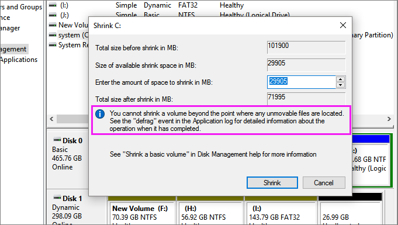

# Common problems

This file documents some common problems we encounter during LIPs and some solutions we used successfully.

## Can't shrink a partition
---

### Option 1 (recommended)
---

We used [MiniTool Partition Wizard](https://www.partitionwizard.com/free-partition-manager.html) several times with success.

With the software installed, select the partition to reduce and choose either **Split partition** or **Move/Resize Partition**.

The program will ask to reboot the computer and will do its magic before Windows boots. It may take a while.

### Option 2
---

The one time MiniTool Partition Wizard failed us, someone managed to shrink the partition using [EaseUS Partition Master](https://www.easeus.com/partition-manager/epm-free.html). We  never tried it, but here it is if it's needed.

## RST (Intel Rapid Storage Tecnology)

aka: I can't see the disk I want to install in

---

If you are installing Ubuntu, it will likely warn you that you have RST enabled. If it's another distro, you may have this problem if the disk you want to install the OS in isn't listed.

To fix this issue, follow the following instructions, totally not copy-pasted from [this answer](https://superuser.com/a/1359471/) on StackOverflow.

> Booting into Safe Mode will work even though the storage mode has been changed... Windows will notice the change and load the correct driver on the next normal boot. Basically that means, you can do this:
>
> Run cmd as administrator (not PowerShell, you would have to escape {...})
>
> Copy-paste this command, which will start Windows in Safe Mode the next time you reboot:
>
> `bcdedit /set {current} safeboot minimal`
>
> Restart the computer and enter UEFI/BIOS setup.
>
> Change the SATA operation mode from RAID to AHCI.
>
> Save changes and exit Setup and Windows will automatically boot to Safe Mode.
>
> Launch cmd again, as in step #1.
>
> Copy-paste this command, which will start Windows in Normal Mode the next time you reboot:
>
> `bcdedit /deletevalue {current} safeboot`
>
> Reboot and Windows will automatically start with AHCI drivers enabled.

## GPU related problems
---

- In `grub`, while on the boot option menu: `e`
- Add one of the flags in between `quiet` and `splash`
- `ctrl x`

### Flags
- `acpi_osi=! acpi_osi="Windows 2009"`
- `nomodeset`
- `nouveau.modeset=0`
- `acpi=0`

### Making changes permanent
When a flag combination works:

- `sudo vi /etc/default/grub`
- Add flags to `GRUB_CMDLINE_LINUX_DEFAULT`
- `sudo update-grub`
